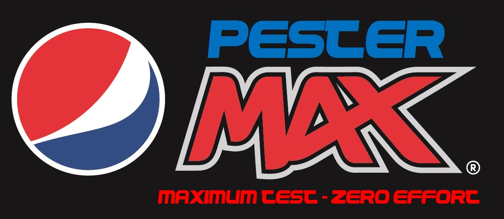
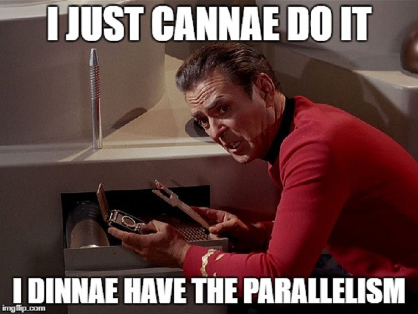
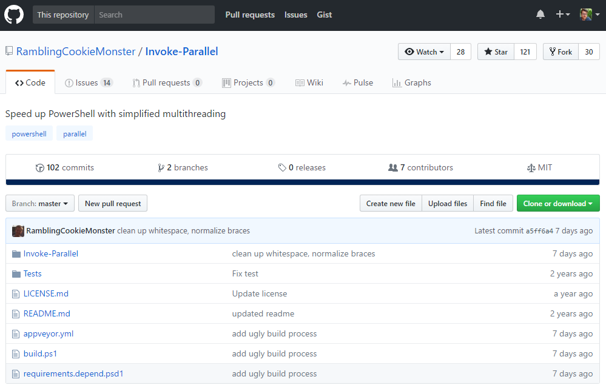
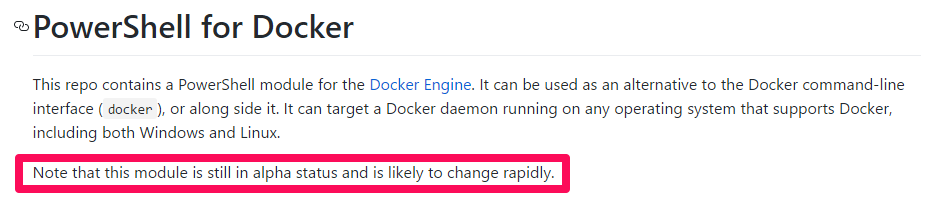
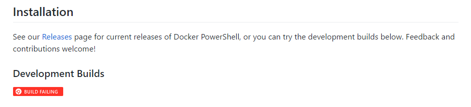

<br>
James Anderson
<br>
www.TheDatabaseAvenger.com
<br>
@DatabaseAvenger
<br>
James@TheSQLPeople.com

---

Pester


<br>
A unit testing framework for PowerShell


<br>
Anyone using it?<!-- .element: class="fragment" -->

---

Included in PowerShell


<br>
Used by the PowerShell team

---

The Basics


* Describe<!-- .element: class="fragment" -->
* Context<!-- .element: class="fragment" -->
* It<!-- .element: class="fragment" -->
* Asserts<!-- .element: class="fragment" -->

---

Sample Tests

```powershell
Describe "Get-SQLInfo" {
    It "returns $true" {
        Get-SQLInfo | Should Be $true
    }
}
```
---

Test Driven Design


<br>
```powershell
New-Fixture -Path Temp -Name Get-SQLInfo
```
---

Linked Test Script

```powershell
$here = Split-Path -Parent $MyInvocation.MyCommand.Path
$sut = (Split-Path -Leaf $MyInvocation.MyCommand.Path).Replace(".Tests.", ".")
. "$here\$sut"

Describe "Get-SQLInfo" {
	It "does something useful" {
		$true | Should Be $false
	}
}
```

---

First Tests Demo

---

Mocking


Faking the response of a piece of code that we aren't currently testing<!-- .element: class="fragment" -->

---

Sample Test with Mocking

```powershell
Context "Get-Random is not random" {
		Mock Get-Random { return 3 }
		It "Get-Random returns 3" {
			Get-SQLInfo | Should be 3
		}
	}
```

---

Sample Test with Mocking Assert

```powershell
Context "Get-Random is not random" {
		Mock Get-Random { return 3 }
		It "Get-Random returns 3" {
			Get-SQLInfo | Should be 3
			Assert-MockCalled Get-Random -Exactly 1
		}
	}
}
```

---

It's not just code that we can test

<br>
Environment tests

<br>
SQL Server test suite

---

Run the Tests Demo

---

So we can run tests, but I don't want to do this manually.


I want the tests to run automatically when I commit.

---


---

Deploy project and test demo

---

So now we have automatic testing everytime we make a change.


<br>
Perfect for teams who are branching code<!-- .element: class="fragment" -->

---

Welcome to Inception Level 1


---

All is good


<br>
But...<!-- .element: class="fragment" -->

---



---

Parallel Tests with Invoke-Parallel



---

Parallel Tests Demo

---

Welcome to Inception Level 2


---

Test against all versions of SQL Server


<br>
No static environments

---


---

PowerShell for Docker





<!-- .element: class="fragment" -->

---

Run Tests Against Containers Demo

---

Welcome to Inception Level 3


---

Problems?


<br>
<br>
Clashing tests?<!-- .element: class="fragment" -->

---

Parallel Tests in Isolation Demo

---

Welcome to Inception Level 4


---

Parallelism, Ultimate Parallelism!
<br>


---

Job done


---

No?

<br>
Docker Cluster<!-- .element: class="fragment" -->

<br>
Tests for tests<!-- .element: class="fragment" -->

---

Welcome to Inception Limbo


---

Thanks for listening
<br>
<br>
Any questions?
<br>
<br>
www.TheDatabaseAvenger.com
<br>
@DatabaseAvenger
<br>
James@TheSQLPeople.com
